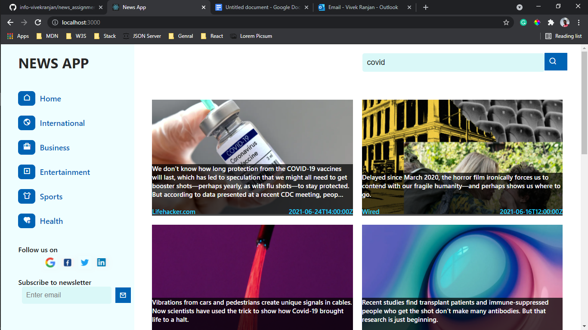
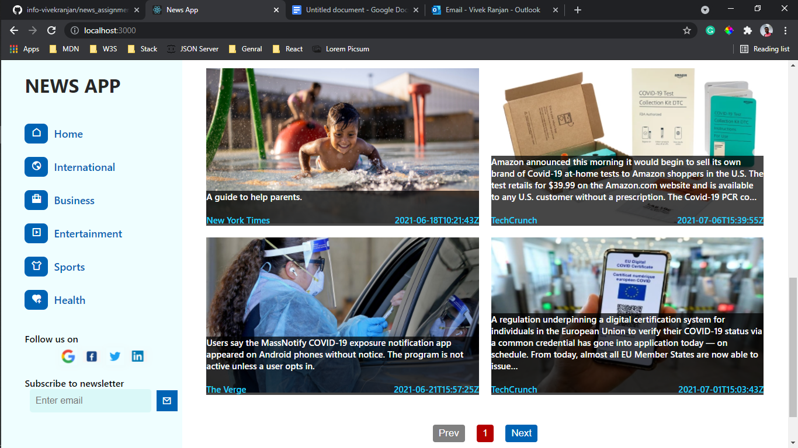

# News-App

## How to run app in your system
- open your terminal or git bash
- Clone https://github.com/info-vivekranjan/news_assignment.git Github Repo in one golder
- Now Make sure you are in /news_assignment folder in the terminal if not, run a command - cd news_assignment
- Now Run npm install
- After that run npm start
- In http://localhost:3000/ this app will run
- after that you can search the news and read 

## Api: Used from https://newsapi.org/

### Tech Stack : Html, Css, Javascript, RecatJs

### Some Images
#### Landing Page:

###

